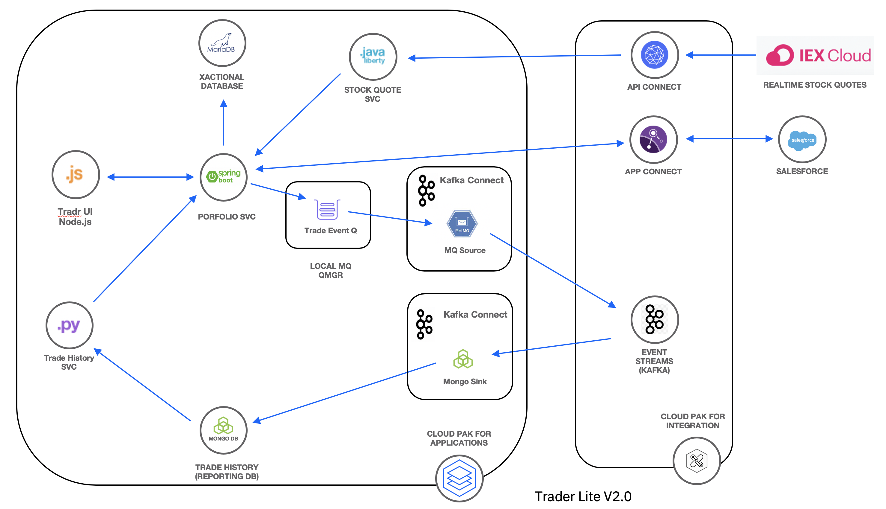

#  Trader Lite - Trade History Service

The IBM Trader Lite application is a simple stock trading sample where you can create various stock portfolios and add shares of stock to each for a commission. The app is used to illustrate concepts in the IBM Cloud Pak for Integration workshop and the App Modernization workshop taught by IBM Client Developer Advocacy.

The **trade-history** microservice is a Python Flask app that exposes a REST API to update/query the historical data in MongoDB. This microservice:

   * adds portfolio trade data the associated Mongo database
   * list all trades for a specific portfolio
   * aggregates all trade data for a specific portfolio

## Building the Trade History Service

This is a Python Flask app built and tested with Python 3.6. The required packages in [requirements.txt](requirements.txt) need to be installed before running this service.

The included [Dockerfile](Dockerfile) can be used to create an image for deployment to Kubernetes.

## Deploying the Trade History  Service

Refer to the IBM Cloud Pak for Integration workshop instructions or the App Modernization workshop instructions on how this service is deployed as part of the Trader Lite app.
